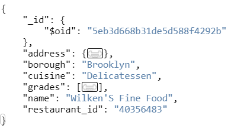
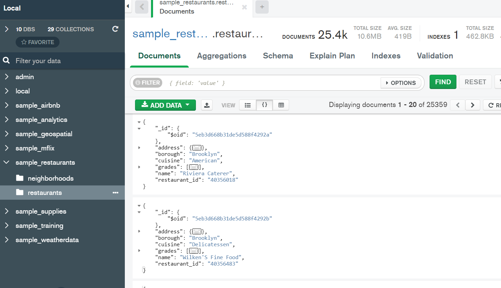
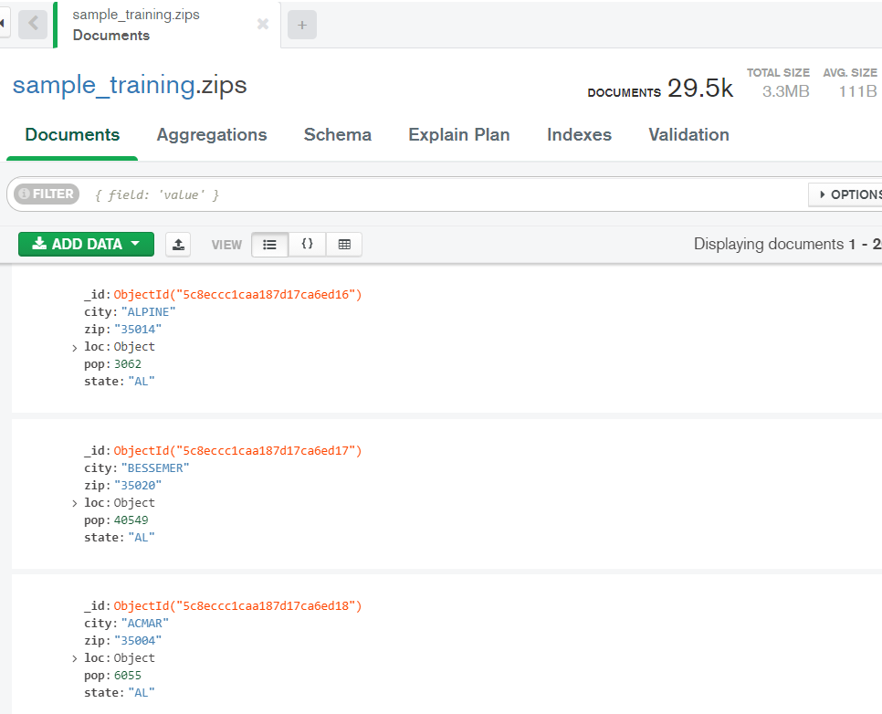
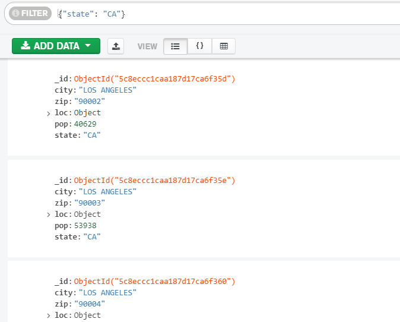
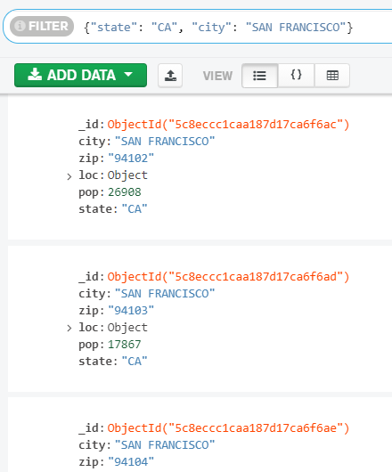
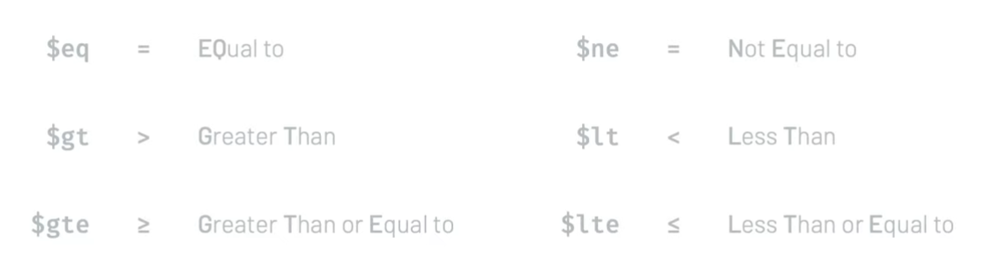
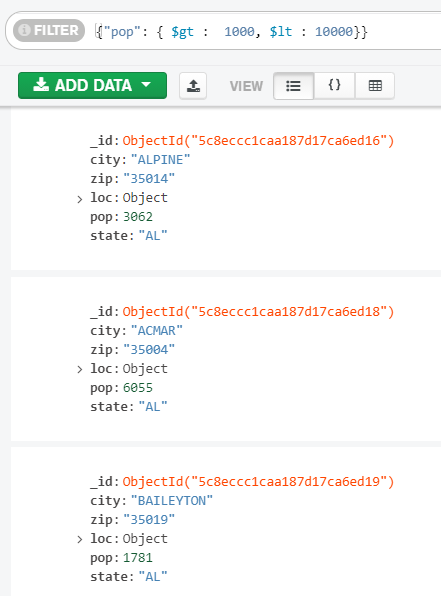
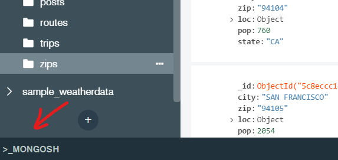

# MongoDB

MongoDB es una base de datos NoSQL en la que la información se organiza en documentos. 

## Documentos

Los documentos almacenan la información como pares clave-valor.  Todas las claves son strings, y siempre hay que escribirlos con comillas; los valores pueden ser datos de cualquier tipo.



JSON es un formato muy popular y fácil de manejar, pero ocupa demasiado espacio. Por este motivo, MongoDB almacena los documentos de forma interna en un formato binario que llaman BSON, pero permite acceder a ellos con sintaxis JSON.

Los documentos pueden contener otros documentos. Todos los documentos contienen un documento `_id`, que es un identificador único. 

Las colecciones son conjuntos de documentos con contenidos similares. Por ejemplo, todos los documentos correspondientes a restaurantes se pueden almacenar en una colección. Al contrario que en una tabla de SQL, podemos colocar documentos con claves totalmente diferentes en la misma colección.

## Instalación

MongoDB se puede utilizar desde nuestro ordenador o en la nube:

* **Instalación local**: descargar la versión gratuita en [https://www.mongodb.com/try/download/community](https://www.mongodb.com/try/download/community)
* **MongoDB Atlas**: es un servicio en la nube de pago, con una opción gratuita que no requiere tarjeta de crédito

Una vez configurada la base de datos, hay que instalar también uno de los servicios para acceder a ella:

* **MongoDB Shell**: línea de comandos
* **MongoDB Compass**: interfaz gráfica
* **API**: disponible para aplicaciones en Python, Java, JavaScript / NodeJS y otros

En este tutorial emplearemos Compass para acceder a una base de datos de MongoDB en la nube. Los pasos a seguir están descritos en la [guía de instalación](https://andresf.gitbook.io/apuntes/almacenamiento/mongodbatlas).

## Visualización de datos

Una vez configurada la base de datos y establecida la conexión desde Compass, podemos ver nuestras bases de datos y conexiones en el panel izquierdo, y pulsar en cualquiera de ellas para ver los documentos.



Las colecciones se denotan como `baseDeDatos.colección`: la colección en la imagen es `sample_restaurants.restaurants`.

Se pueden añadir nuevos documentos con la opción `Add Data`. MongoDB les asigna automáticamente un ID único. Los botones arriba a la derecha en la vista de documento permiten editar, copiar al portapapeles, clonar y borrar documentos.

## Búsqueda de datos

En este apartado vamos a utilizar el dataset `sample_training.zips`, en los datos de ejemplo de MongoDB. Contiene información sobre los códigos postales de Estados Unidos:



Al contrario que en SQL, las queries se escriben en formato JSON, indicando las claves por las que queremos filtrar y los valores que deben tomar. Por ejemplo, para buscar todos los códigos postales en California escribimos `{"state": "CA"}`.



Se pueden combinar varias condiciones en una búsqueda:



En las queries se pueden usar operadores de comparación como `$eq` (igual a) y `$gt` (mayor que):



Para buscar los distritos postales con más de 1.000 pero menos de 10.000 habitantes, se podría usar `{"pop": { $gt:  1000, $lt: 10000}}`.



Si no incluimos ningún operador, MongoDB añade automáticamente el operador `$eq`: la query `{"state": "CA"}` es equivalente a `{$eq: {"state": "CA"}}`.

Los operadores lógicos son `$and`, `$or`, `$not` y `$nor`:

* `$and`: verdadero si se cumplen todas las condiciones

* `$or`: verdadero si al menos una de las condiciones se cumple

* `$nor`: verdadero si no se cumple ninguna de las condiciones dadas

* `$not`: verdadero si la condición es falsa

Si una query incluye varias condiciones y ningún operador, MongoDB añade automáticamente el operador `$and`. Por ejemplo, las dos queries a continuación son idénticas, pero es mucho más cómodo usar la primera:

```
{"pop": { $gt :  1000, $lt : 10000}}

{"$and": [{"pop": {"$gt": 1000}}, {"pop": {"$lt": 10000}}]}
```

## Línea de comandos

La interfaz gráfica es útil para visualizar el conjunto de datos y realizar consultas y modificaciones rápidas, pero sólo da acceso a una pequeña parte de la funcionalidad de MongoDB; la mayoría de operaciones sólo se pueden realizar desde la línea de comandos. Compass incluye una línea de comandos que se puede abrir pulsando sobre `>_MONGOSH` en la barra inferior.



En este ejemplo ejecutamos la misma búsqueda que en el apartado anterior:

```bash
# Mostrar todas las bases de datos
show dbs

# Seleccionar una
use sample_training

# Mostrar las colecciones
show collections

# Realizar una query
db.zips.find({"state": "CA"})
db.zips.find({"state": "CA"}).pretty()

# Se muestran 20 resultados por pantalla.
# Para ver los 20 siguientes escribir "it" (iterate)
it
```


## Modificar datos

Los documentos se pueden modificar desde la línea de comandos con:

* `updateMany`: modifica todos los documentos que cumplan la condición

* `updateOne`: modifica sólo el primer documento que encuentre. Como los documentos no están ordenados, el documento que se modificará es aleatorio

En ambos casos, la sintaxis utiliza dos objetos JSON: el primero se utiliza para buscar los documentos que queremos cambiar, y el segundo define la modificación.

```bash
# Añadir 100 habitantes a todas las ciudades de California
db.zips.updateMany({"state": "CA"}, {"$inc": {"pop": 100}})
```

Los operadores de modificación son:

* `$inc`: aumenta un valor numérico (o lo disminuye si la cantidad es negativa)
* `$set`: cambia el valor de una clave
* `$unset`: elimina una clave
* `$push`: añade un valor a un array


## Borrar datos

Usar las funciones `deleteOne` o `deleteMany`.

```bash
# Eliminar California del conjunto de datos
db.zips.deleteMany({"state": "CA"})
```

También podemos borrar colecciones o bases de datos enteras con `drop`:

```bash
# Eliminar la colección zips
db.zips.drop()

# Eliminar la base de datos
db.dropDatabase()
```


## Referencias

Hemos elaborado este tutorial a partir del curso gratuito **M001: MongoDB Basics** en [MongoDB University](https://university.mongodb.com).
