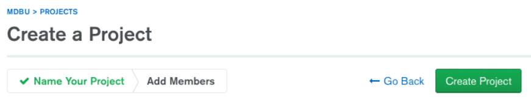

# MongoDB Atlas

Atlas es un servicio en la nube que ofrece acceso a bases de datos MongoDB. 

Está organizado en tres niveles: `Organizaciones -> Proyectos -> Bases de datos`. Cada base de datos se almacena en un clúster. Los clústers gratuitos ofrecen 512 MB de almacenamiento y réplicas de los datos en tres máquinas.

## Creación de una base de datos

1. Registrar una cuenta de usuario en https://www.mongodb.com/en/cloud/atlas/signup. También se puede utilizar una cuenta de Google.

2. Crear una nueva organización pulsando en `Create an Organization`.

   

3. Elegir un nombre para la organización y seleccionar `MongoDB Atlas` como proveedor.

   

4. En la pantalla siguiente se puede agregar a más usuarios a la organización. Dejarlo en blanco por ahora.

5. Crear un proyecto vacío con `Create Project`. Pulsar Siguiente en el diálogo para añadir nuevos miembros.

   

6. Inicializar una base de datos dentro del proyecto con el botón `Build a Database`.

   

7. Seleccionar el nivel gratuito.

   

8. Elegir un proveedor de servicios (cualquiera sirve; en todos los casos manejaremos la base de datos desde la interfaz de Atlas y no se nos cobrará nada). Escoger la localización más cercana para los datos.

   

Para seguir el tutorial oficial de MongoDB, elegir como nombre de clúster **Sandbox**. El clúster tardará unos minutos en crearse.

## Conectarse a la base de datos

Para ver todas las bases de datos en el proyecto, pulsar en `Databases` en el menú a la izquierda de la página.

Pulsar en `Connect` para autorizar las conexiones a la base de datos desde el exterior. Como es un proyecto de prueba no nos preocupa que sea público: elegir `Allow Access from Anywhere`, y a continuación `Add IP Address`.

Por último, crear un usuario y contraseña para acceder a la base de datos.

En la página siguiente se puede elegir entre varias opciones para conectarse a la base de datos: **MongoDB Shell** (línea de comandos), **MongoDB Compass** (interfaz de usuario gráfica), o desde una API para aplicaciones.

Seleccionar la opción Compass y copiar el "connection string". Si no tenemos instalada la aplicación, se puede descargar en la opción "I do not have MongoDB Compass".

Por último, abrir la aplicación Compass y pegar el string, reemplazando `<username>` y `<password>` por la contraseña de usuario que elegimos en el paso anterior.

Si todo ha salido bien, ya tenemos acceso al clúster desde Compass:

## Cargar el dataset de demostración

En el panel de control de MongoDB Atlas ([cloud.mongodb.com](https://cloud.mongodb.com)), ir a la vista de bases de datos y elegir la opción `Load Sample Dataset` . 

