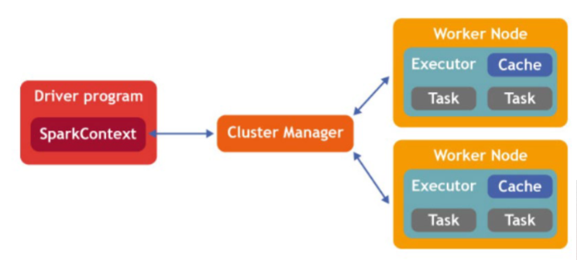
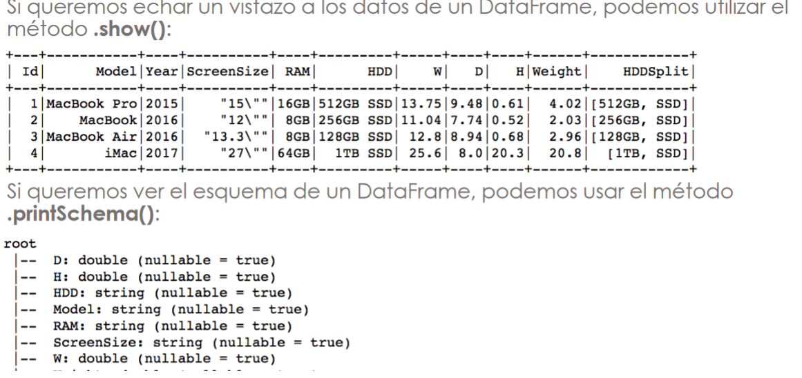
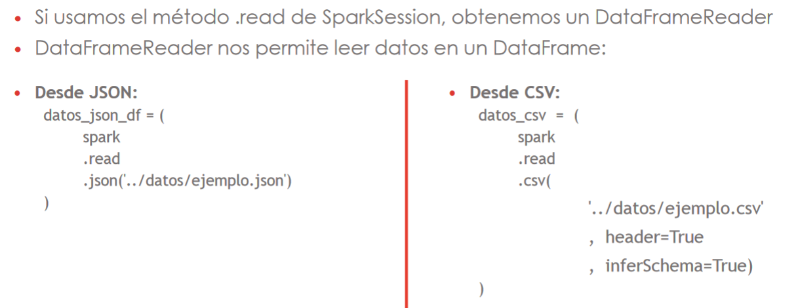

# Spark

Spark es un sistema de computación distribuida. Tiene la capacidad de ejecutarse en memoria RAM, lo que lo hace adecuado para procesamiento de datos en tiempo real.

Está escrito en Scala, y también se puede usar con Java, Python, R y SQL. Se puede utilizar en combinación con casi cualquier sistema de almacenamiento (Hadoop, Cassandra, etc.).

Las aplicaciones se pueden ejecutar localmente, en modo interactivo, o en un clúster, enviando tareas a los ordenadores del clúster mediante un scheduler. Los schedulers más habituales son YARN (NodeManager + ResourceManager) y Spark Standalone (Spark Worker + Spark Master); es aconsejable usar YARN.

Al contrario que MapReduce, que siempre emplea dos pasos de computación, Spark puede dividir el cálculo en cualquier número de pasos, organizados mediante una DAG (gráfica acíclica dirigida), y no necesita escribir en disco los resultados de las tareas intermedias.

Spark trabaja con tres estructuras de datos:

* **RDD** (resilient distributed dataset): tablas de sólo lectura que garantizan la resistencia a fallos
* **Dataframes**: tablas estructuradas en las que cada columna tiene un nombre y un tipo de datos. No confundir con los dataframes de Pandas
* **Datasets**: son un término medio entre RDD y dataframe

Lo más habitual en PySpark es usar dataframes, porque las RDD tienen rendimiento bajo y los datasets no están disponibles en Python.

La librería SparkML permite usar Spark para aprendizaje automático.

## Instalación

Estos comandos instalan PySpark y Hadoop en un notebook de Jupyter ejecutándose sobre Debian o Ubuntu (incluyendo Google Colab).

```python
!apt-get install openjdk-8-jdk-headless -qq > /dev/null
!wget -q https://downloads.apache.org/spark/spark-3.1.2/spark-3.1.2-bin-hadoop3.2.tgz
!tar xf spark-3.1.2-bin-hadoop3.2.tgz
!pip install findspark

import os
import findspark
os.environ["JAVA_HOME"] = "/usr/lib/jvm/java-8-openjdk-amd64"
os.environ["SPARK_HOME"] = "/content/spark-3.1.2-bin-hadoop3.2"
findspark.init()
```

## Spark Sessions

Una SparkSession es el punto de entrada de una aplicación Spark.

Se puede crear con SparkSession.builder(). Las sesiones interactivas crean automáticamente una SparkSession, llamada spark.
```python
from pyspark.sql import SparkSession
spark = SparkSession.builder\
        .master("local")\
        .appName("Colab")\
        .config('spark.ui.port', '4050')\
        .getOrCreate()
```

???+ note
    En versiones anteriores de Spark, había varios puntos de entrada para cada parte de la aplicación: SparkContext para RDD, SQLContext para SQL, etc. SparkSession los combina todos en uno.
???

## Estructura de la aplicación



Una aplicación Spark se asigna a un único proceso de controlador y un conjunto de procesos de ejecutor, distribuidos a través del clúster, que se crean y destruyen automáticamente en función de las necesidades del programa. El proceso de controlador gestiona el flujo de trabajo y lo distribuye en tareas, y los ejecutores ejecutan las tareas. Un ejecutor puede ejecutar varias tareas a la vez.  

## RDD
Los RDD (resilient distributed dataset) son tablas de sólo lectura que contienen información no estructurada. Los datos pueden estar distribuidos en varios nodos, y la información se puede recuperar automáticamente si uno de los nodos falla.
Los cálculos sobre RDD se realizan mediante:

* **transformaciones**: funciones que devuelven otro RDD. Ej.: map, filter, flatmap, sample, union, intersection
* **acciones**: funciones que devuelven un valor. Ej.: reduce, collect, count

Spark es "perezoso" (lazy): las transformaciones sólo se ejecutan cuando sus resultados son necesarios para calcular alguna acción.

## Dataframes
Los dataframes son conjuntos de datos de sólo lectura organizados en tablas. Están creados a partir de RDDs, pero ofrecen mejor rendimiento y más capacidades. 

Al contrario que los RDDs, los dataframes contienen datos estructurados: cada columna tiene un nombre y sólo puede contener un tipo de datos. 



Para crear un dataframe a partir de un archivo de datos, usar `SparkSession.read`:



Los dataframes se pueden manejar con SQL o con funciones. [Ver notebook con ejemplos](spark-dataframes.ipynb)


## SparkML
La librería por defecto para aprendizaje automático en Spark es SparkML (`pyspark.ml`). Se puede utilizar con RDDs o dataframes.
```python
from pyspark.ml.recommendation import ALS
from pyspark.ml.evaluation import RegressionEvaluator  

(training, test) = ratings.randomSplit(\[0.8, 0.2\])

# Entrenamos el modelo
als = ALS(maxIter=5, regParam=0.01, userCol="user_id", itemCol="id", ratingCol="rating",
coldStartStrategy="drop")
model = als.fit(training)

# Evaluamos el modelo con RMSE
predictions = model.transform(test)
evaluator = RegressionEvaluator(metricName="rmse", labelCol="rating", predictionCol="prediction")
rmse = evaluator.evaluate(predictions) 
print("Root-mean-square error = " + str(rmse))

# Generar las 10 mejores recomendaciones para un subconjunto de usuarios
userSubsetRecs = model.recommendForUserSubset(usuario_EP, 5)
```