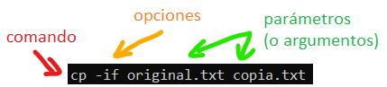
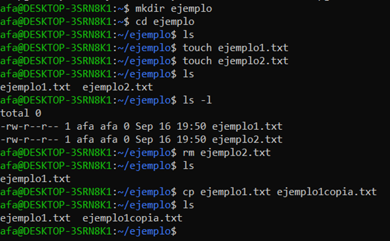
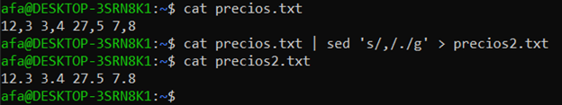
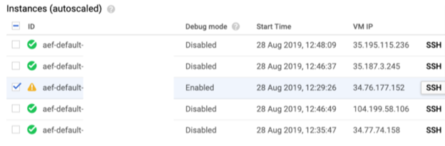
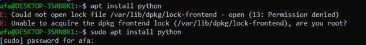
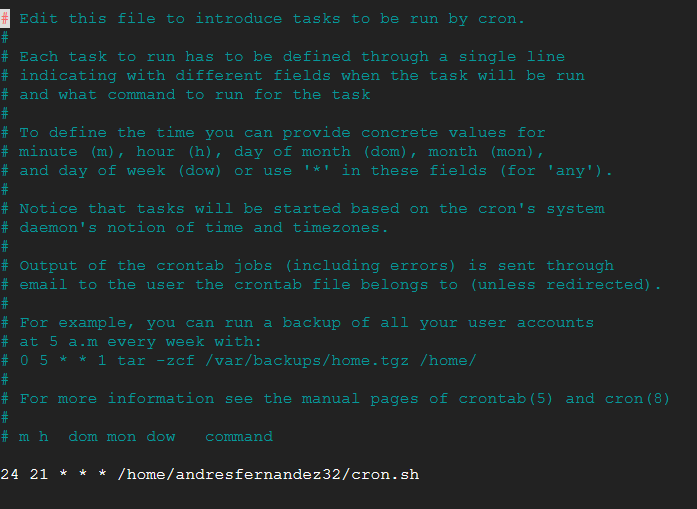

# Línea de comandos de Linux

 

La mayoría de sistemas operativos basados en Linux contienen un conjunto de programas pequeños conocidos como GNU coreutils, que dan acceso a la funcionalidad básica del sistema: manejo de archivos, edición de texto, etc.

 

Las opciones pueden ser cortas (**ls -l**) o largas (**ls --version**). Las opciones cortas se pueden dar todas a la vez: **ls -lsr**. Al contrario que Windows, Unix distingue mayúsculas de minúsculas. 

Pulsar **Ctrl-C** interrumpe la ejecución de cualquier programa.

 

## Sistema de archivos

Al igual que Windows, Unix emplea un sistema de archivos jerárquico.

|                                 | **Windows**                                                  | **Linux**                               |
| ------------------------------- | ------------------------------------------------------------ | --------------------------------------- |
| Directorio raíz                 | C:\                                                          | /                                       |
| Otros discos duros / USB / etc. | D:\,  E:\,  etc.                                             | /mnt/sda1,   /mnt/sda2,  etc.           |
| Directorio casa del usuario     | C:\Usuarios\nombre_usuario                                   | /home/ nombre_usuario   Atajo:   ~ |
| Escritorio                      | C:\Usuarios\nombre\Escritorio                                | ~/Desktop                               |
| Archivos de programa            | C:\Archivos de programa   C:\Archivos de programa (x64) | /usr/bin                                |

 

El símbolo ~ se puede escribir con AltGr + 4 y hace referencia al directorio “casa” del usuario actual. 

Las rutas pueden ser 

* absolutas (/usr/ejemplo.txt)

* relativas al directorio actual (ejemplo.txt)

* relativas al directorio casa del usuario (~/ejemplo.txt)

 

## Navegación

* **pwd** (present working directory): mostrar la ruta completa del directorio actual

* **ls** *directorio* (list): muestra todos los archivos en el directorio dado. Si no le pasamos ningún argumento, utiliza el directorio actual
  * **ls -l** incluye información sobre el tamaño y permisos de los archivos
  * **ls -a** incluye archivos ocultos
  * **ls -R** muestra también los archivos en subdirectorios

* **cd** *directorio* (change directory): se mueve al directorio indicado
  * Para ir al directorio superior, **cd ..**

 

## Archivos y directorios

* **touch** *nombre*: crea un archivo vacío

* **mkdir** *directorio* (make directory): crea un directorio vacío

* **cp** *origen* *destino*: copia el archivo origen al destino

* **mv** *origen* *destino*: mueve el archivo origen al destino

* **rm** *archivo* (remove): elimina un archivo
  * **rmdir** elimina directorios

  * Para borrar todos los archivos y subdirectorios, **rm –rf \*.\*** (mirar bien en qué directorio estamos antes de ejecutar esto)

## Ayuda

* **man** *comando* (manual): muestra instrucciones de uso de un comando
  * Los manuales suelen tener muchas páginas. Para salir, pulsar q

## Manejo de texto

La mayoría de programas en Linux utilizan texto plano como entrada y salida. 

* **cat** *archivo*: abre un archivo de texto y muestra su contenido. Si pasamos varios archivos, los concatena y después los muestra todos juntos

* **grep** *texto* *archivo*: busca el texto dado en un archivo

* **sed** *archivo operación* (stream editor): realiza búsquedas y sustituciones sencillas. El primer argumento es el archivo, y el segundo es un string cuya primera letra indica la operación que queremos hacer:
  * **s** (substitute): busca una expresión y la sustituye por otra. La sintaxis es **‘****s/****regexp****/****sustitución****/****g****’** donde *regexp* es la expresión regular que buscamos, *sustitución* es el texto con el que la reemplazamos y la *g* (opcional) indica que queremos reemplazar todas las veces que aparezca la expresión y no sólo la primera.
  * **d** (delete): borra el texto. Se suele usar en combinación con un número de línea: **`1d`** elimina la primera línea.

Normalmente la salida de un programa se muestra por pantalla. El operador **|** (pipe) permite concatenar comandos, pasando la salida de un comando como entrada al siguiente. También podemos almacenar la salida del comando en un archivo: **>>** añade la información al final del archivo, y **>** lo sobreescribe.

Por ejemplo, si tenemos una serie de precios que usan la coma como separador decimal y queremos cambiarlas a puntos:

## Editores de texto

Casi todas las distribuciones de Linux incluyen al menos uno de estos editores de texto gráficos, que se pueden usar directamente desde la consola:

* **nano**: editor sencillo. Para abrir un archivo escribir en la consola nano *nombre_archivo*, y al terminar de editarlo salir con Ctrl-X.

* **vi**: editor potente pero sorprendentemente difícil de usar. Ver https://www.openvim.com/ 

## Secure Shell

Normalmente vamos a querer utilizar estos comandos para controlar máquinas de forma remota. La forma estándar de abrir un terminal en un ordenador diferente es **ssh** (secure shell).

Antes de poder usarlo hay que instalar y configurar un servidor ssh en el ordenador remoto: **apt install openssh-server**. Una vez hecho esto, nos podemos conectar a él desde cualquier otro ordenador con **ssh \*direcciónIP\***, y ejecutar comandos con **ssh \*servidor comando\***.

Los servicios en la nube (Google Cloud, etc.) ya manejan todo esto por nosotros, y permiten abrir una terminal en la máquina remota pulsando un botón:

## Instalar programas

Las máquinas virtuales suelen usar sistemas operativos con muy pocos programas instalados, para ahorrar espacio. Para instalar lo que necesitemos hay que usar un “gestor de paquetes”:

* En Debian, Ubuntu y similares, **apt**: 
  * apt get
  * apt remove. Esto mantiene la configuración del programa; para borrarla usar apt purge
  * apt update

* En Alpine y otras distribuciones minimalistas, **apk**: 
  * apk add
  * apk del
  * apk update

Estos comandos requieren permisos de superusuario. (Ver sección siguiente)

## Comandos de superusuario

En Unix hay usuarios normales, con permisos restringidos, y superusuarios (también llamados root), que tienen control absoluto sobre el sistema. En general se usa siempre una cuenta de usuario normal, para evitar romper cosas por accidente. Si queremos usar un comando que requiere permisos de superusuario, podemos usar la utilidad **sudo**, que ejecutará solamente ese comando como root (después de pedirnos la contraseña).

## Cron jobs
Cron se usa para que el sistema ejecute automáticamente scripts cada cierto tiempo.
Cada usuario tiene una lista de trabajos cron, que se puede editar con `crontab -e`.
En cada línea de la lista hay cinco números, que representan el minuto, hora, día, mes y día de la semana en que se debe ejecutar el script, y se pueden reemplazar por un * para que se ejecute siempre. Por ejemplo, para ejecutar un comando todos los días a las 9:24 de la noche, escribimos `24 21 * * *`. A continuación se escribe el comando a ejecutar. 

Los scripts se ejecutarán con los permisos del usuario al que corresponde la cron file. También hay una cron file del sistema, que puede ejecutar scripts con los permisos de cualquier usuario.

## Alternativas

Hay también sistemas basados en Linux que no utilizan las coreutils de GNU. La mayoría de los comandos en este documento seguirán funcionando, pero algunos tendrán menos opciones o directamente no existirán. A veces podremos instalar los programas que faltan con un gestor de aplicaciones.

* **Busybox:** es un sustituto de las coreutils para sistemas que tienen que ocupar muy poco espacio, como Alpine Linux. Contiene la mayoría de los programas, pero suelen tener menos opciones. 

* **Mac OS:** como son Apple, implementan únicamente los programas que les da la gana. 

* **Hadoop:** HDFS no es un sistema operativo, sino un sistema de archivos distribuido. Aunque algunos comandos de Hadoop tienen el mismo nombre, la forma de trabajar es totalmente diferente. 