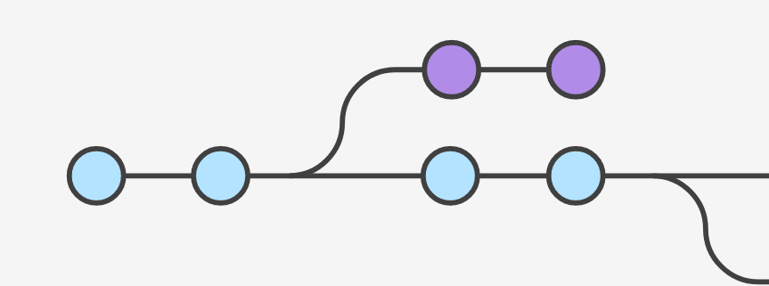
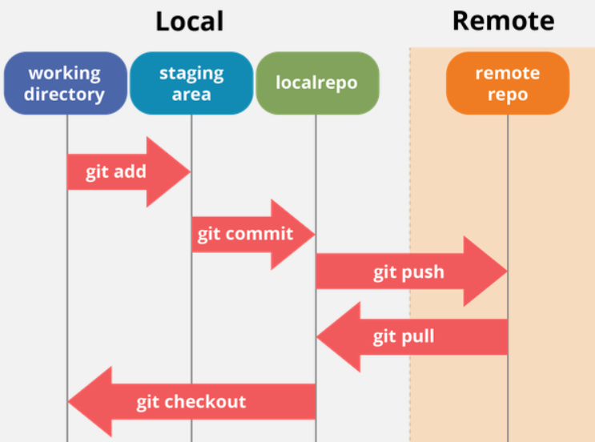
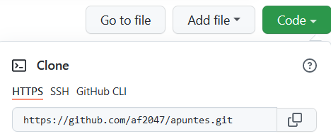
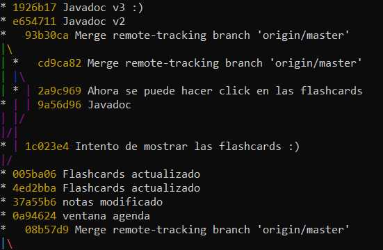
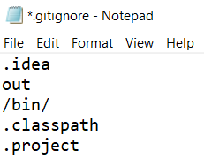
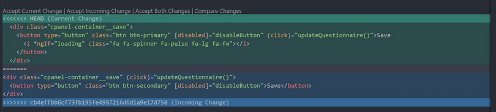

# Git y GitHub



## Instalación

Descargar git de https://git-scm.com/download, y seguir estos pasos:

```bash
# Configurar el nombre y correo que aparecerá en nuestros commits
git config --global user.name "nombre"
git config --global user.email "correo@ejemplo.com"

# Abrir un cuadro de diálogo para añadir nuestra cuenta de GitHub
git config --global credential.helper manager-core
```

La mayoría de editores de código tienen alguna interfaz gráfica para trabajar con git, que suele ser más cómoda que la línea de comandos.

## Funcionamiento de git

git maneja tres zonas de archivos:



Los datos internos de git se almacenan en una subcarpeta oculta, `.git`. Todos los demás archivos forman parte del working directory. Para trabajar con git modificamos archivos en el working directory, seleccionamos los cambios que queremos guardar con `git add`, y finalmente los guardamos en el repositorio con `git commit`. Si tenemos un repositorio remoto, en GitHub o en otro proveedor, podemos sincronizar nuestro repositorio local y el remoto con `git pull` y `git push`.

git no almacena las diferencias entre versiones, sino que guarda una copia completa de todos los archivos cada vez que cambian. Por este motivo no es aconsejable utilizarlo para archivos grandes; en ese caso usar [Git Large File Storage](https://git-lfs.github.com/).

##### Crear un repositorio

Para crear un repositorio vacío, `git init`. Para copiar un repositorio existente, `git clone *enlace*`. 



##### Guardar nuestros cambios

Para guardar los archivos en el repositorio y poder compartirlos en GitHub hay que meterlos en un commit. 

`git add .` pasa todos los archivos a la *staging area*, una zona intermedia donde se pueden revisar antes de guardarlos definitivamente , y `git commit` los guarda en el repositorio.

```bash
git add .                 # El punto selecciona todos los archivos
git commit -m "Mensaje"   # Guarda los archivos en el repositorio
```

##### Ver el historial

Para mostrar el historial de commits del proyecto, `git log --all --oneline --graph`.



El contenido de `git log` puede ser muy largo; si no cabe en pantalla, pulsar `Intro` para avanzar y `q` para salir.

Los commits están identificados por un código en hexadecimal: `1926b1...` . Para referirse a ellos basta con dar las cuatro o cinco primeras letras. `HEAD` representa el commit actual.

`git diff *commit1* *commit2*` muestra las diferencias entre dos commits.

Si hemos introducido un fallo pero no sabemos exactamente cuándo, usar `git bisect *commit_malo* *commit_bueno*` (donde el primer commit presenta el fallo y el segundo no).

##### Volver a un commit anterior

`git checkout *commit* .` (no olvidarse del punto) reemplaza nuestro working directory con el contenido del commit dado. Este comando borra de forma permanente cualquier cambio no guardado que hayamos hecho desde entonces.

##### Etiquetas

Las etiquetas se usan para marcar commits importantes, y aparecen resaltadas en `git log` y en GitHub.

`git tag *etiqueta* *commit*` añade una etiqueta al commit indicado (o al commit actual si omitimos ese argumento).

##### gitignore

Podemos crear un archivo `.gitignore` en el directorio raíz, que indica los archivos y directorios que git va a ignorar. Es buena idea meter aquí las configuraciones de la IDE o los resultados de compilación (normalmente sólo queremos compartir el código fuente).



##### Claves de API

Si nuestra aplicación contiene claves de API o contraseñas, utilizar [GitHub secrets](https://docs.github.com/en/actions/security-guides/encrypted-secrets#creating-encrypted-secrets-for-a-repository).

## Trabajo en equipo

Git es un sistema distribuido: cada usuario tiene una copia independiente del repositorio entero. Los cambios que hacemos con git commit, branch, merge, etc. sólo afectan a nuestro repositorio local, y no se sincronizan automáticamente con el repositorio remoto en GitHub; hay que hacerlo manualmente con `git pull` y `git push`.

##### Enlazar el repositorio local con el remoto

Por defecto llamamos "origin" al repositorio remoto:

```bash
git remote add origin https://ejemplo.git
```

Sólo hay que hacer esto una vez; y clonar un repositorio remoto ya lo hace por nosotros.

##### Sincronizar

`git pull` descarga los cambios en el repositorio remoto y los incorpora a nuestro proyecto. Si alguien ha estado modificando archivos al mismo tiempo que nosotros, probablemente se producirá un *merge conflict*, que nos indica que git tiene dos versiones del mismo archivo y no sabe con cuál debe quedarse. Para resolver el conflicto hay que elegir una de las versiones (o una mezcla de ambas) y crear un nuevo commit. La mayoría de IDEs tienen una opción dedicada a resolver estos conflictos:



Para subir nuestros cambios al repositorio remoto, usar `git push origin master`.

## Resumen

Ésta es probablemente la forma más sencilla de usar git y GitHub para un equipo pequeño:

* Antes de empezar a trabajar, descargar los cambios que han hecho otros compañeros con `git pull`
* Al terminar de trabajar:

  1. `git add .`
  2. `git commit`
  3. Hacer otro `git pull`, por si alguien ha estado cambiando cosas al mismo tiempo que nosotros
  4. Si se produce algún merge conflict, corregirlo y volver al paso 1
  5. Si no hay conflictos, enviar nuestros cambios al repositorio remoto con `git push`

En proyectos más grandes, tradicionalmente se usaban flujos de trabajo más complejos como [GitFlow](https://nvie.com/posts/a-successful-git-branching-model/). En la actualidad es más común usar un modelo con una sola rama, a la que se van añadiendo cambios pequeños de forma tan frecuente como sea posible ([trunk-based development](https://www.atlassian.com/continuous-delivery/continuous-integration/trunk-based-development)).
