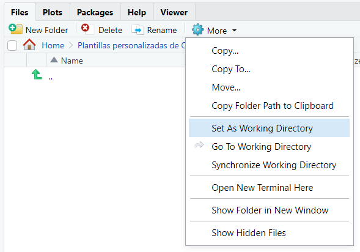

# R

R es un lenguaje de programación orientado a la estadística.

## Recursos

* **Ejercicios en clase**: [gasolineras](gasolineras.R), [primer ejercicio de clase](EjercicioClase.R), [examen parcial](ExamenParcial.R), [último ejercicio de clase](Actividad1.R)
* "Cheat sheets": en el menú de RStudio, `Help -> Cheat Sheets`
* [Documentación del tidyverse](https://www.tidyverse.org/packages/)
* Libros: [R for Data Science](https://r4ds.had.co.nz/index.html), [Advanced R](https://adv-r.hadley.nz/index.html)

## Introducción

##### Variables

Asignamos variables con `x <- 3` (atajo en RStudio: `Alt` + `-`). Los nombres de variables y funciones se suelen escribir en minúsculas separadas por barras bajas. Las mayúsculas y minúsculas se consideran letras diferentes. 

Los tipos más usados son:

* `character`: a pesar del nombre, pueden tener varias letras

* enteros (`integer`), punto flotante (`double`)

* `logical`: `TRUE` o `FALSE`

* `list`: listas (`list(1, 2, 3)`) o diccionarios (`list(a=1, b=2)`)

* vectores (similares a las listas, pero sólo contienen valores de un tipo): `c(1, 2, 3)`; `1:5`

* `raw`: datos en formato binario

* `date` para fechas, `dttm` (datetime) para fechas con día y hora

Los missing values aparecen representados como `NA`. La función `typeof` muestra el tipo de una variable. Para cambiar de tipo usar `as.integer`, `as.tibble`, etc.

Para acceder a valores en una lista o vector, usar corchetes: `vector[3], lista[2], diccionario["a"]`. Al contrario que en Python, los índices empiezan en 1.

##### RStudio

`Ctrl + Intro` ejecuta la línea actual, y `Ctrl + Shift + S` ejecuta el script entero. `Ctrl + Shift + R ` añade una sección nueva.

RStudio conserva el estado del programa y los paquetes instalados al cerrarlo y volverlo a abrir. El icono de la escoba en el panel Environment borra los objetos en el entorno. 


Para reiniciar por completo el entorno (borrar los objetos y eliminar los paquetes instalados), `Ctrl` + `Shift` + `F10`.

R busca archivos en el "working directory", que podemos cambiar con las opciones en el panel Files:



##### Pipes

El operador pipe (`%>%`, atajo en RStudio: `Ctrl + Shift + M`) pasa la variable a su izquierda como el primer argumento para la función a su derecha: `x %>% f(y, z)` equivale a `f(x, y, z)`. Lo usaremos para encadenar funciones sin tener que almacenar los resultados intermedios en variables.

##### Funciones

```R
suma <- function(x,y){x+y}
```

##### Bucles

```R
for(url in url_vector) {  
  res <- GET(url) %>% headers()
  peso <- peso + as.numeric(res_$`content-length`)
}
```

##### Condicionales

```R
mutate(flights, distancia = ifelse(distance > 5000, "largo", "corto"))
mutate(ccaa=case_when(idccaa=="01" ~ "Andalucía", idccaa=="02" ~ "Aragón"))
```

##### Ejemplos

En los ejemplos voy a usar el dataset `flights`, que se instala con `pacman::p_load(nycflights13)`.


## Tibbles

Las tibbles son un formato de tablas usado en todo el tidyverse. Se pueden crear manualmente: `tibble(x=1:10, y=2*x, z= 5)`, pero normalmente las obtendremos a partir de un dataset.

Para seleccionar una columna de la tibble usar el símbolo `$`: `flights$carrier`, o bien `flights[[carrier]]`. Si queremos varias columnas podemos usar `dplyr::select(flights, dep_delay, arr_delay)`, que devuelve otra tibble con sólo las columnas elegidas.

`glimpse() ` imprime un resumen del contenido de la tibble.

Las funciones del tidyverse usan tibbles, pero otras funciones de R siguen usando dataframes; las podemos convertir a tibbles con `as_tibble(df)`. 


## Instalación de paquetes

Para ahorrarse líos utilizar el paquete `pacman`:

```R
packages.install("pacman")  # Instalar pacman, sólo hay que hacerlo una vez
pacman::p_load(tidyverse, leaflet, janitor, httr, jsonlite, xml2)
```

## Core tidyverse

El "núcleo" de tidyverse son estos ocho paquetes (en negrita los que hemos usado en el curso):

* **dplyr**: manipulación de datos (`mutate`, `select`, `filter`...)
* **tidyr**: limpieza de datos (`drop_na`, `replace_na`...)
* **readr**: lectura de CSV (`read_csv`). Para leer otros formatos hay que usar otros paquetes (ver abajo)
* **tibble**: la estructura básica de datos del tidyverse
* **ggplot2**: gráficas. Según dicen ellos, *"It’s hard to succinctly describe how ggplot2 works because it embodies a deep philosophy of visualisation"*. En la práctica, no hay forma humana de entenderlo. [Aquí](https://r4ds.had.co.nz/data-visualisation.html) hay un tutorial
* purrr
* **stringr**: manipulación de strings (`str_extract`...)
* forcats 

Además hay muchos paquetes más pequeños, que dan funcionalidad adicional: **httr**, **jsonlite**, **xml2**, **readxl**...

Instalar el tidyverse instala todos estos paquetes, pero `p_load(tidyverse)` sólo carga los ocho paquetes del núcleo. Para usar los otros paquetes hay que añadir el nombre del paquete y dos puntos (`jsonlite::fromJSON()`), o bien cargar el paquete manualmente (`pacman::p_load(jsonlite)`, después ya se puede escribir `fromJSON()`).

También hemos usado algunos paquetes que no son parte del tidyverse:

* **janitor**: limpieza de datos
* **leaflet**: dibuja mapas

## Lectura de datos

##### csv

Utilizar `readr::read_csv`:

* el primer parámetro es el nombre de archivo (relativo al working directory)
* si el archivo está separado por `;` en vez de `,`, utilizar `read_csv2`
* `read_csv` asume que la primera fila contiene los nombres de las columnas. Si esta fila no existe, `col_names=FALSE`
* para ignorar las n primeras filas, `skip=n`
* si nuestros números tienen separadores diferentes de los que se usan en EE.UU., indicarlos con `locale=locale(decimal_mark=",", grouping_mark=".")`

R intenta inferir el tipo de cada columna, generalmente sin mucho éxito. Si no funciona bien, limpiar los datos manualmente y ejecutar `type_convert(tibble)` para que vuelva a inferir los tipos.

`write_csv` pasa la tibble a un archivo.

##### Otros formatos

* Excel: `readxl::read_excel`
* XML: `xml2::read_xml(url, encoding="UTF-8")`, `write_xml(archivo)`
* JSON: `jsonlite::fromJSON(url)`, `toJSON(archivo)`

## Acceso a Internet

Usar `httr::GET(url)`. Esto nos da un objeto `response`, que contiene la información ("content") y metadatos.

```R
r <- httr::GET(url)

content(r)      # Contenido
status_code(r)  # Código de estado
headers(r)      # Metadatos de la respuesta
```

Podemos pasar el contenido directamente al disco duro con `httr::GET(url, write_disk("archivo.xml"))`.

Los [códigos de estado](https://en.wikipedia.org/wiki/List_of_HTTP_status_codes) más comunes son:

* **200** OK
* **204** No Content: petición correcta, pero la respuesta del servidor está vacía
* **400** Bad Request: petición inválida
* **401** Unauthenticated / **403** Forbidden: no tenemos permiso para acceder
* **404** Not Found: no hay ningún recurso en la dirección solicitada
* **5xx**: errores del servidor

Si no lee bien el contenido, utilizar `content(r, "text", encoding="UTF=8")` (el encoding que hay que usar está en los headers) ó `content(r, "raw")`.

```R
url <- "https://sedeaplicaciones.minetur.gob.es/ServiciosRESTCarburantes/PreciosCarburantes/EstacionesTerrestres/"

r <- httr::GET(url)
# Si quisiéramos escribirlo en disco, GET(url, write_disk("gasolineras.xml"))

status_code(r)  # 200 (OK)

# Consultar el header content-type para ver el tipo de archivo y el encoding
headers(r)  # content-type: application/xml; charset=utf-8

# Para leer un XML, pasarle el contenido del request como texto:
datos_xml <- xml2::read_xml(content(r, as="text"))

# Para leer un JSON, podemos pasar directamente la URL (sin necesidad de usar httr)
datos_json <- jsonlite::fromJSON(url)
```

También podemos enviar peticiones POST con `httr::POST`. Para subir un archivo, 

```R
httr::POST(url,body=list(x=upload_file('ejemplo.csv')))
```


## Limpieza de datos

El primer paso es usar estas funciones de `janitor` (`janitor` no es parte del tidyverse y hay que instalarlo por separado):

* `clean_names`: elimina caracteres no válidos de los nombres de variables
* `remove_empty`: elimina filas y columnas que solamente contienen `NA`

Después, usar `glimpse()` para ver un listado de columnas y comprobar que ha inferido los tipos correctamente. En caso contrario, corregirlos con la opción `across` de `dplyr::mutate`: 

```
flights <- flights %>% mutate(across(year, as.character))
```

## Manipulación de datos (dplyr)

Las funciones en **dplyr** sólo funcionan bien con datos "ordenados" (forma rectangular, una observación por fila, una variable por columna, missing values indicados como `NA`). Siempre devuelven una tibble nueva, sin modificar la original.

Las funciones básicas son (en negrita las que hemos usado):

- **select**: elegir solamente algunas variables (columnas)

  ```R
  select(flights, month)
  select(flights, carrier, arr_delay)
  select(flights, contains("delay"))
  ```

  `select` también se puede usar para cambiar el orden de las columnas:

  ```R
  # Mover los aeropuertos de origen y destino al principio
  select(flights, origin, dest, everything())
  ```

* **rename**: renombrar columnas. Poner el nombre nuevo delante del `=`, y el antiguo detrás:

  ```R
  rename(flights, distancia = distance)
  ```

- **filter**: eliminar las observaciones que no cumplen las condiciones dadas. También elimina las observaciones con missing values

  ```R
  filter(flights, month == 5)
  filter(flights, month == 5, day == 12)
  filter(flights, month == 11 | month == 12)
  filter(flights, month %in% c(11, 12))
  ```

- **mutate**: añadir columnas nuevas al final de la tibble, cuyos valores pueden depender de los valores en otras columnas

  ```R
  mutate(flights, delayed = (arr_delay > 0))
  mutate(flights, distancia = ifelse(distance > 5000, "largo", "corto"))
  mutate(ccaa=case_when(idccaa=="01" ~ "Andalucía", idccaa=="02" ~ "Aragón"))
  ```

- **arrange**: reordenar las filas en función de los valores de una o varias columnas. Las filas con missing values se colocan al final

  ```R
  # Ordenar los vuelos por fecha
  arrange(flights, year, month, day)
  
  # Ordenar los vuelos por su retraso, en orden descendente
  arrange(flights, desc(arr_delay))
  ```

* **count**: cuenta el número de valores únicos de una columna, y nos da el número de veces que aparece cada uno.

  ```R
  count(flights, carrier)
  count(flights, carrier, sort=T)
  ```

* **separate**: divide una columna en dos o más columnas nuevas. Los argumentos son la columna de origen, los nombres de las columnas de destino, y el separador

  ```R
  separate(flights, col=time_hour, into=c('date', 'time'), sep=" ")
  ```

Estas funciones se pueden usar en combinación con `group_by()`, que agrupa los datos que tienen propiedades iguales (por ejemplo, los vuelos de la misma compañía), pero hasta que lo veamos en clase no me voy a meter en ello. Más información [aquí](https://r4ds.had.co.nz/transform.html#grouped-summaries-with-summarise).

## Gráficos

Usamos el paquete `ggplot2`. Se utiliza llamando a la función `ggplot`, donde el parámetro `data` es el dataset y `aes` la columna, y sumándole otra función para dar una forma al gráfico:

```R
# Histograma (var. continuas)
ggplot(data=flights, aes(arr_delay)) +  geom_histogram()

# Diagrama de barras (var. discretas)
ggplot(data=flights, aes(carrier)) +  geom_bar()

# Scatterplot (dos variables)
ggplot(data=flights, aes(dep_delay, arr_delay)) + geom_point()
```


## Mapas

Utilizamos los paquetes `leaflet` y `leaflet.extras`(asegurarse de cargar los dos).

Por defecto utiliza el mapa OSM (OpenStreetMap), que incluye información de carreteras, etc. Para visualización es mejor usar un mapa más limpio, como CartoDB.

Para incluir nuestros datos en el mapa usar addMarkers, addCircles ó addHeatmap. `leaflet` va a buscar la información de latitud y longitud en columnas que se llamen `latitude` y `longitude`; si las nuestras tienen un nombre diferente, pasarlas como argumentos con la virgulilla (~).

```R
m <- df3 %>% leaflet() %>%
  addProviderTiles("CartoDB") %>%  # Add default OpenStreetMap map tiles
  addHeatmap(lng=~`Longitud (WGS84)`, lat=~Latitud, radius=10)
  #  addCircles(lng=~`Longitud (WGS84)`, lat=~Latitud, popup="Gasolinera")

m  # Mostrar el mapa
```

Para más opciones de visualización, [https://www.htmlwidgets.org](htmlwidgets.org).

## Uso de memoria

Podemos ver cuánta memoria ocupa un objeto de R con `object.size(objeto)`.

Para ver cuánto ocupan los datos descargados de Internet con `httr`, consultar la propiedad `content_length` en su header.

Los resultados vienen en bytes.

## Manipulación de strings

Utilizamos el paquete `stringr`, incluido en el core tidyverse.

La función `str_extract` permite buscar texto con expresiones regulares:

```R
shopping_list <- c("apples x4", "bag of flour", "bag of sugar", "milk x2")
str_extract(shopping_list, "\\d")
```

Si hay varios substrings que cumplan la expresión regular, sólo nos devolverá el primero. Para obtenerlos todos, usar `str_extract_all`.